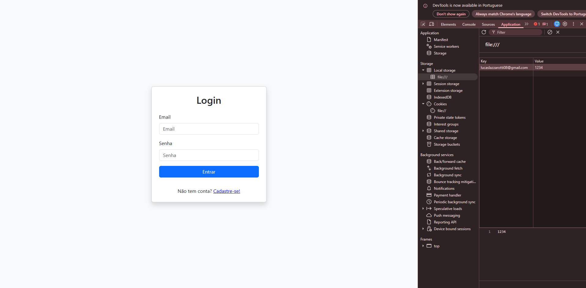

# login-bootstrap

By Lucas Lazzarotti

Após uma aula expositiva sobre a criação de formulários de cadastro e a apresentação da ferramenta Bootstrap, desenvolvi um formulário aplicando os recursos de estilização oferecidos pela biblioteca. O resultado foi uma interface mais intuitiva, organizada e visualmente agradável, proporcionando uma melhor experiência ao usuário. 

